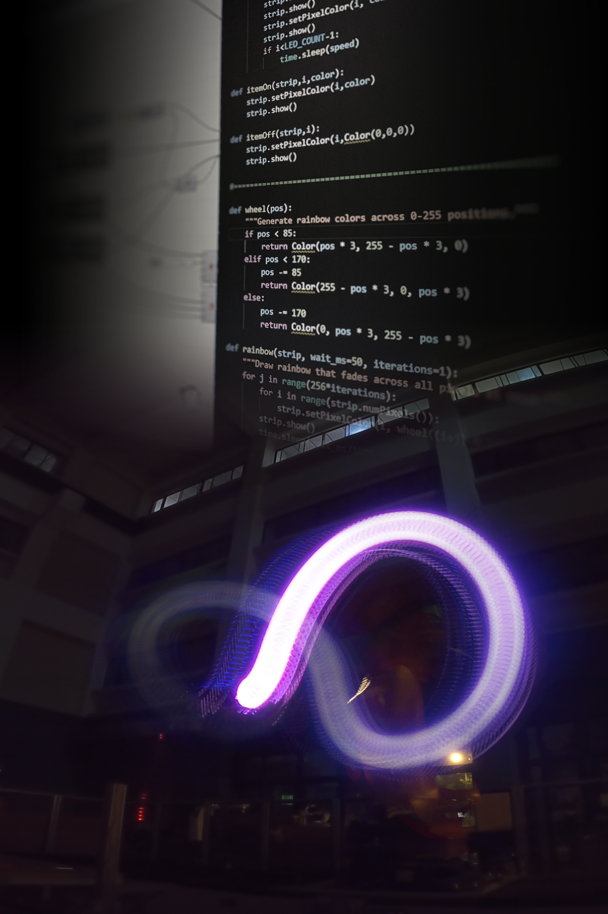

# Computational Design Fundamentals Workshop

at Department of Architecture, National Cheng Kung University (NCKU), Taiwan

## Workshop Team

* ChiaChing Yen
* Jia Shao Hsu
* Wai Ting Hsiao

## Workshop Description

This workshop will introduce computational tools and produce light drawings using NCKU's KUKA KR300. 

## Schedule

### Part I: Introduction to Python / COMPAS
Saturday, 27th, Nov, 2021
09:00 - 17:00 AM GMT+8

### Part 2: Introduction to Robotics / ROS
Sunday, 27th, Nov, 2021
09:00 - 17:00 AM GMT+8

# Files
We will share the main tools and files via this repository.
## Slides
### Day 1
* [Slides](https://docs.google.com/presentation/d/1tahWXxf2nWbqUAjqU-1wBMUrXO0rNCbNOPYWozIY7lY/edit?usp=sharing)

### Day 2
* [Slides](https://docs.google.com/presentation/d/15ec5Wa7KNDxkGU1VqWV8aeNBdFWXe9WfvMc_ZKurvFs/edit?usp=sharing)
* [KUKA Operator Training Level 1](https://docs.google.com/presentation/d/15XVlAwplSnY7Gh0MX_H0Y_2SLvio-tZHKGouif-THcs/edit#slide=id.g104a09d43b2_0_116)

# Platforms

## Software

### Rhino

We will be using Rhino as the primary platform. 
If you don't have it already, you can download a 90-day free evaluation version of Rhino 7 here:

* [Windows 90-day Evaluation](https://www.rhino3d.com/download/rhino-for-windows/evaluation)

* [MacOS 90-day Evaluation](https://www.rhino3d.com/download/rhino-for-mac/evaluation)

### Grasshopper

[Grasshopper](https://www.rhino3d.com/features/#grasshopper) is a plugin for Rhino, and as of version 7, is installed by default in both the Mac and Windows versions. To open Grasshopper within Rhino, simply type "Grasshopper" in the command line or click the Grasshopper icon in the Standard toolbar (second from far right, green circle with insect).

#### KUKA | prc
[KUKA｜prc](https://drive.google.com/open?id=1O63rN-ZNFxLWrAJdCIpXqGN213gcix0F&authuser=ccyen%40umich.edu&usp=drive_fs) builds upon the accessible visual programming system Grasshopper, which is a part of the CAD software Rhinoceros 3D.
It provides the robotic building blocks to directly integrate a KUKA robot into a parametric environment. Instead of writing code, simple function-blocks are connected with each other and the results immediately visualized.

### Anaconda 3

We use Anaconda to make sure Python and all required libraries are installed correctly on all platforms. Please use the following download to install it:

* [Anaconda Individual Edition](https://www.anaconda.com/products/individual)

### Visual Studio Code

Most of the examples will be used from Rhino/Grasshopper, but the option to use them as stand alone scripts might create more opportunities. For that reason, we recommend installing the free code editor Visual Studio Code along with its Python extension:

* [VS Code](https://code.visualstudio.com/)
* [Python extension](https://marketplace.visualstudio.com/items?itemName=ms-python.python)

### Docker

[ROS image file](https://drive.google.com/file/d/1ils6S9j3ilRyXF-IqWPwPT7AnrxqdZIX/view?usp=sharing)

## Installation

We use `conda` to make sure we create a clean, isolated coding environment:

### Get the workshop files

    git clone https://github.com/raccoon-ncku/Workshop_AAD21.git
    cd Workshop_AAD21
    conda env create -n AAD21 --file requirements.txt

### Add COMPAS to Rhino

    python -m compas_rhino.install -v 7.0
